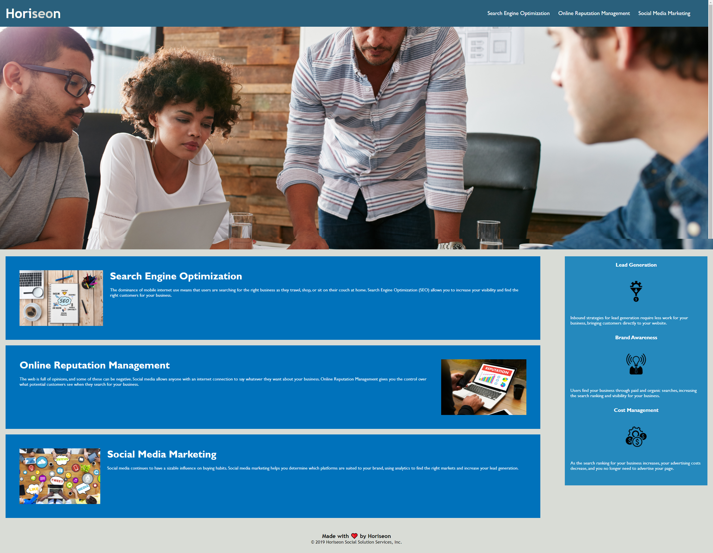

# code_refactor
First homework assignment for bootcamp

## HTML Changes

* Added better semantic tags so the source code made more sense.
* Added indentation so the HTML was more logical and easier to follow.
* Added alt attributes to all images. 
* Changed heading attributes so they follow a sequential order.
* Gave title a clear and concise title.

## CSS Changes 

* Updated CSS Selectors and properties to make sure CSS file was consolidated and organized to follow semantic structure.

## Screenshot

## Link
